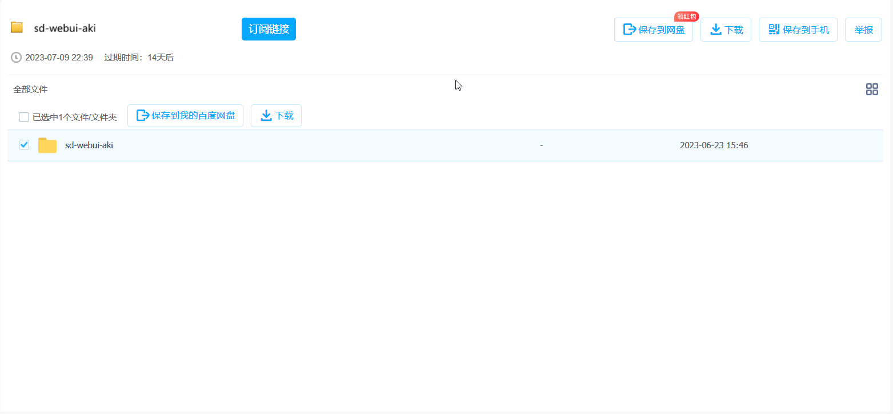
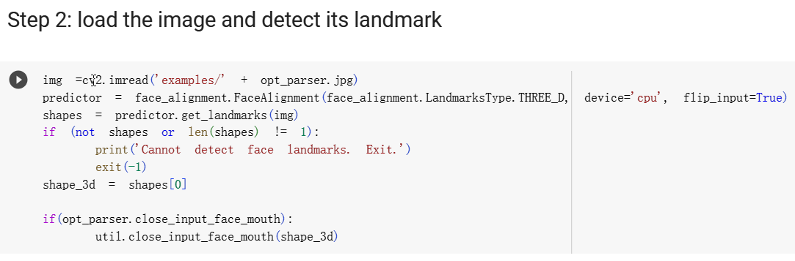
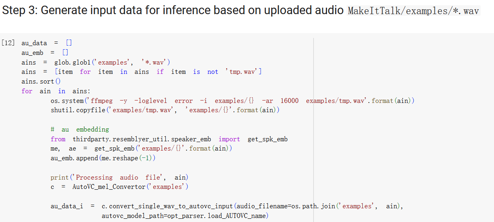

# 暑假实习项目

## AI生成图片

### 项目要求

+ 用stable diffusion产生中国，英国，俄国，法国，西班牙，葡萄牙，日本，阿拉伯国风格的男女模特或者地理风情的真实风格图片，总计80张（每个国家特色的10张），然后考虑人物的动画自动生成，包括语言对嘴型，以及各种情绪的动作和表情
+ 使用真实风格的模型
+ 这里按照男：女= 1：1的比例来生成这些图片

## 基本步骤

### 配置环境

+ 首先第一步需要在本地配置stable diffusion的环境，现在可以在b站找到相应的一键部署整合包，这里给出我使用的资源链接
  + [【AI绘画】Stable Diffusion整合包v4.2发布！全新加速 解压即用 防爆显存 三分钟入门AI绘画 ☆可更新 ☆训练 ☆汉化_哔哩哔哩_bilibili](https://www.bilibili.com/video/BV1iM4y1y7oA/)
    + 第一步下载整合包
    + 第二步，解压`sd-webui-aki-v4.2.7z`，并安装`启动器运行依赖-dotnet-6.0.11.exe`
    + 安装完成后，打开文件夹后双击`A启动器.exe`即可打开引导界面   
      
    + 点击`一键启动`即可在网页端打开控制面板页面
    + 至此stable diffusion的环境配置完成
  + 这个up也提供了一些关于二次元画风的图片生成教程，感兴趣的同学可以参考这个链接[【AI绘画】从零开始的AI绘画入门教程——魔法导论【持续更新】 - 哔哩哔哩 (bilibili.com)](https://www.bilibili.com/read/cv22159609)，但由于其个人价值观问题，未提供真人模型的训练方式，故后续的训练是我自己的经验
  + 附上显卡速度天体榜[sdperformance - Grist (getgrist.com)](https://docs.getgrist.com/3mjouqRSdkBY/sdperformance)

### 模型学习

+ 配置好环境之后，就可以开始进行模型生成，如果只是想要根据tags进行图片生成，只需要根据喜好添加所需的tags即可。

+ **注：**尽可能使用好的显卡进行训练，如果打开整合包后显示只能使用CPU进行训练，我的建议是去艺传学院的机房，听说那边显卡是3060

+ 如果要进行的是真人的模型训练，则需要进行以下步骤
  + 首先通过学习了解到stable diffusion的基本模型，并根据其模型特征来选择我们所需要的模型，以便于后续训练，推荐网站[https://civitai.com/](https://link.zhihu.com/?target=https%3A//civitai.com/)
    + 基础大模型
      + SD系列，stable diffusion自带模型，效果不是很好，但若想自行训练模型，则需要以此为基础模型（需下载完整版）
      + final-prune、animefull-latest系列，为NovelAI出的大模型，没有突出特色，比较中庸，属于中规中矩的基础模型
    + 二次元大模型
      + Anything系列，说是anything，其实主要是二次元漫画模型，出图效果最好，但风格比较单一，对关键词要求不高
      + 葡萄柚、Hassaku系列，明亮、清晰的动漫风格模型，但后者非常容易出**NSFW**图片，谨慎使用，不需要额外的VAE
      + Cetus-Mix，二次元混合模型，对提示词要求不高
    + 写实大风格
      + Chilloutmix/Chikmix模型，用于亚洲美女生成的经典模型
      + Deliberate系列，万能模型，风格上偏油画和数绘风格，关键词必须详细填写
      + Realistic Vision系列，比较适合人或动物，相对万能
    + 5D/数绘风格
      + PerfectWorld，欧美版的Chilloutmix模型，主要绘制于欧美风格的女性，偏2.5D，介于动漫和现实之间，基本默认**NSFW**，谨慎使用
      + 国风系列，中国华丽古风风格模型，具有2.5D质感
    + 特定风格
      + 明快CrispMix，强调明快清爽，适合于时尚装饰的展示
      + linecakeA1，配合Graphic design（LORA）使用效果最佳
    + LORA微调模型
      + 可以直接在C站中寻找相应模型下载后放入相应文件夹加载，即可使用
      + KoreanDollLikeness/Taiwan doll likeness，配合Chilloutmix使用的亚洲女性lora，但需注意法律风险
  + 这里我们要制作亚洲和欧洲以及拉丁美洲的模特图像和风景照，故选择
    + 亚洲：Chilloutmix作为基础大模型，同时使用lora模型进行微调
      + lora模型可以选择直接从C站下载训练好的模型，也可以自行训练想要的模型（配置要求较高）
      + 训练教程
    + 欧洲：PerfectWorld+Lora，先尝试一下看看效果
    + 拉丁美洲：找到了Latin Beauty模型，尝试效果
  + 部署模型到stable diffusion
    + 大模型：存放路径：\sd-webui-aki-v4\models\Stable-diffusion
    + lora模型：存放路径：\sd-webui-aki-v4\models\Lora
    + 未知模型：存放路径：[https://spell.novelai.dev/](https://link.zhihu.com/?target=https%3A//spell.novelai.dev/)在此网站解析后放入相应路径即可
  + 部署完成后开始进行模型生成
    + 首先进行中国女性模特的生成
      + 首先通过chatgpt和C站上示例给出基础的正向tag和反向tag，并使用不同lora模型进行生成
      + 在自行尝试多次之后，发现直接抄C站的作业非常好用，就是模型下起来确实很麻烦，若生成要求不多，建议直接一个base model走到底，找有区分的lora模型来进行微调

### 动画生成尝试

+ 进行动画生成，基础目标为嘴型动，其实可以达到整个模型动的效果，只是效果不佳
  + 尝试使用D-ID和HeyGen进行生成，前者效率更高，后者效果出奇的好，可惜都需要付费
  + https://studio.d-id.com/和 https://app.heygen.com/
+ 因此尝试MakeItTake进行模拟，由于模型较大，初次尝试在colab进行demo运行
  + 以下是运行过程中，遇到的问题
    + 首先是这里的问题在于`face_alignment.LandmarksType.THREE_D`中的`LandmarksType`是没有_3D属性的，而是`THREE_D`属性，而初始代码使用的是前者
    + 然后是此错误，是python中常见的库版本更新问题，在文件`requirements.txt`中，修改`librosa==0.9.2`即可
+ 使用另一个模型`first-order-model`进行动画生成，可以通过输入的gif、音频或动画来进行生成图片的动画模拟
  + 具体使用步骤没有上面那么复杂，直接运行其demo即可，可以选择不同拟合模式，具体效果如下

### 图片生成

+ 进行生成中国，英国，俄国，法国，西班牙，葡萄牙，日本，阿拉伯国风格的男女模特图片，每个国家仅展示男女各一张，其余存储在文件夹中
+ 首先是中国
  + 女性：
  + 男性：
+ 英国
  + 女性：
  + 男性：

+ 俄国
  + 女性：
  + 男性：

+ 法国
  + 女性：
  + 男性：

+ 西班牙
  + 女性：
  + 男性：

+ 葡萄牙
  + 女性：
  + 男性：

+ 日本
  + 女性：
  + 男性：

+ 阿拉伯
  + 女性：
  + 男性：

## 经验总结

### 模型选择

#### 大模型

+ 最通用的，兼容风格最多的——**Realistic Vision V5.1**
+ 最具创造力的，偏向于浪漫风格的——**DreamShaper**

#### Lora模型

+ 全靠关键字，只能说AI绘画的驱动力是**和资本
+ 效果最好的是亚洲

#### tips

+ 直接在网上找相关的模特图片，放进tagger中进行tag的提取
+ 若提取后文生图的效果不佳，后续可进行图生图的处理

