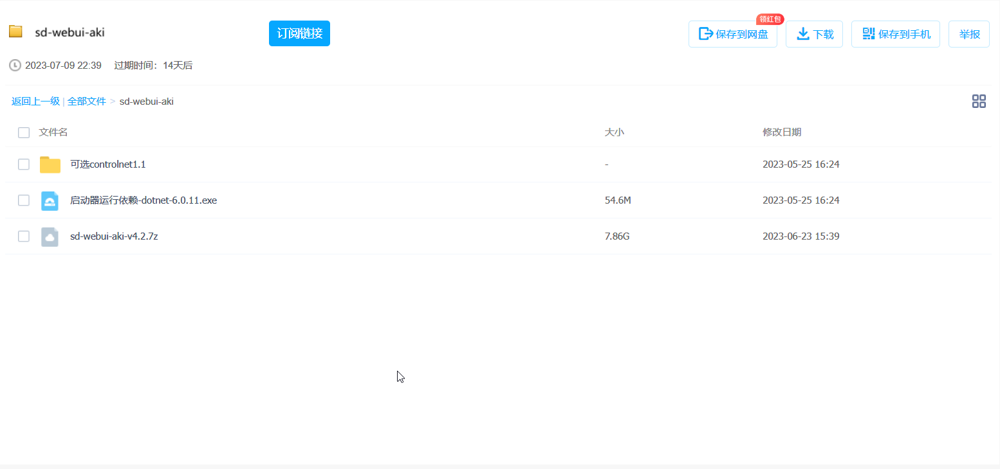
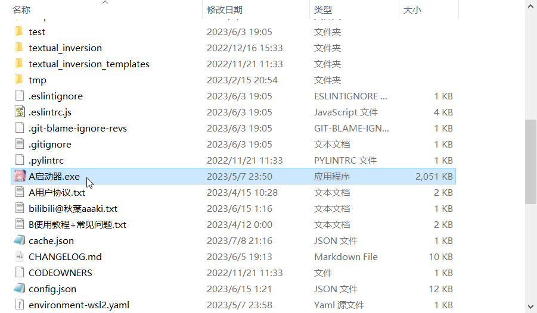
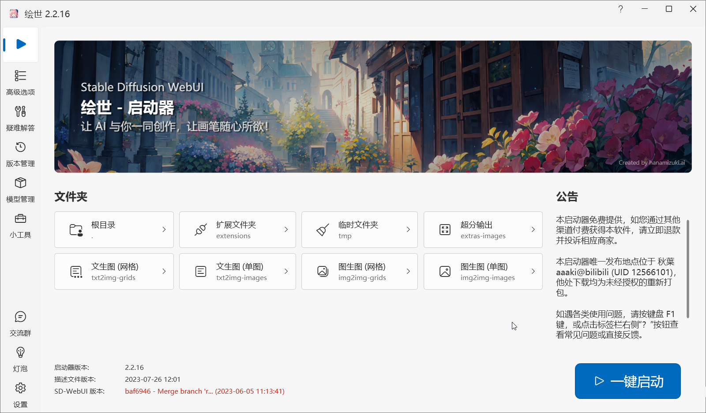
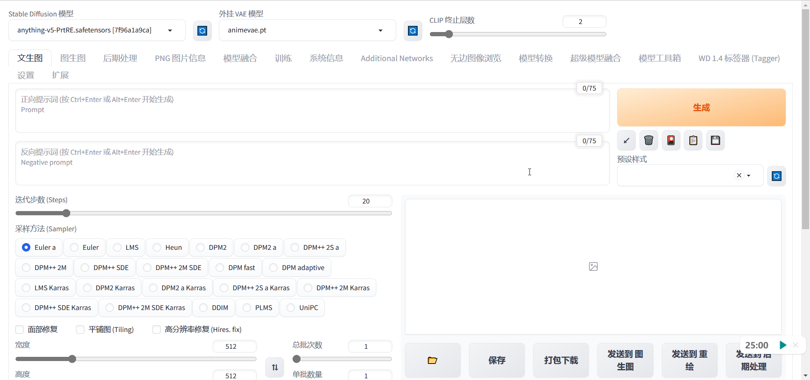

# 暑假实习项目

## AI生成图片

### 项目要求

+ 用stable diffusion产生中国，英国，俄国，法国，西班牙，葡萄牙，日本，阿拉伯国风格的男女模特或者地理风情的真实风格图片，总计80张（每个国家特色的10张），然后考虑人物的动画自动生成，包括语言对嘴型，以及各种情绪的动作和表情
+ 使用真实风格的模型

### tags设计

+ 中国风格：(Chinese),(female|male),(black hair),(brown eyes),(pale skin),(slim),(cheongsam|tang suit|hanfu|qipao|modern clothing),(jade|pearl|silver|gold),(fan|umbrella|lantern|flower),(pagoda|temple|palace|garden|mountain)
+ 英国风格：(British),(female|male),(blonde|brown|red hair),(blue|green|brown eyes),(fair skin),(tall),(suit|dress|coat|hat|scarf),(watch|ring|necklace|earrings),(umbrella|glasses|book|tea cup),(castle|church|bridge|park|city)
+ 俄国风格：(Russian),(female|male),(blonde|brown hair),(blue|green eyes),(fair skin),(strong),(fur coat|jacket|dress|boots),(hat|muffler|gloves),(balalaika|matryoshka doll|vodka bottle),(kremlin|cathedral|monument|forest|snow)
+ 法国风格：(French),(female|male),(brown|black hair),(brown|hazel eyes),(olive skin),(slender),(beret|scarf|dress|suit),(perfume|lipstick|earrings|rings),(baguette|wine bottle|cheese plate|( (Eiffel Tower))|( (Louvre))|( (Notre Dame))|( (Arc de Triomphe))
+ 西班牙风格：(Spanish),(female | male), (black | brown hair), (brown | hazel eyes), (tan skin), (curvy | muscular), (flamenco dress | shirt | pants | shoes), (flower | fan | shawl | earrings), (guitar | castanets | sangria glass), (( (Alhambra)) | (( (Sagrada Familia)) | (( (Plaza Mayor)) | (( (bullring)))
+ 葡萄牙风格：(Portuguese), (female | male), (black | brown hair), (brown | green eyes), (olive skin), (average height), (dress | shirt | skirt | pants), (necklace | bracelet | earrings | ring), (guitarra portuguesa | pastel de nata | wine glass | cork), (( (Belem Tower)) | (( (Jeronimos Monastery)) | (( (Pena Palace)) | (( (Porto Bridge)))
+ 日本风格：(Japanese), (female | male), (black hair), (brown eyes), (pale skin), (petite), (kimono | yukata | school uniform | cosplay), (hairpin | fan | umbrella | glasses), (sakura | sushi | sake cup | manga), (( (Mount Fuji)) | (( (Tokyo Tower)) | (( (Kyoto Temple)) | (( (Osaka Castle)))
+ 阿拉伯风格：(Arabic), (female | male), (black hair), (brown eyes), (tan skin), (slim), (abaya | hijab | niqab | thawb), (gold | silver | pearl | ruby), (hookah pipe | coffee pot | dates plate | sword), (( (pyramid)) | (( (mosque)) | (( (desert)) | (( (oasis)))

### 动画生成

+ 使用Inpaint工具，可以在图像中标记出您想要移动的部分，然后生成多个变化的图像，然后将它们导入一个GIF或视频制作工具中，形成一个动画效果。
+ 使用Deforum扩展，可以从头开始生成一种“变形”的动画，它会将一个图像逐渐变成另一个图像，并输出一个MP4视频文件，您还可以添加音频。

## 基本步骤

+ 首先第一步需要在本地配置stable diffusion的环境，现在可以在b站找到相应的一键部署整合包，这里给出我使用的资源链接
  + [【AI绘画】Stable Diffusion整合包v4.2发布！全新加速 解压即用 防爆显存 三分钟入门AI绘画 ☆可更新 ☆训练 ☆汉化_哔哩哔哩_bilibili](https://www.bilibili.com/video/BV1iM4y1y7oA/)
    + 第一步下载整合包
    + 第二步，解压`sd-webui-aki-v4.2.7z`，并安装`启动器运行依赖-dotnet-6.0.11.exe`
    + 安装完成后，打开文件夹后双击`A启动器.exe`即可打开引导界面   
      
    + 点击`一键启动`即可在网页端打开控制面板页面
    + 至此stable diffusion的环境配置完成
  + 这个up也提供了一些关于二次元画风的图片生成教程，感兴趣的同学可以参考这个链接[【AI绘画】从零开始的AI绘画入门教程——魔法导论【持续更新】 - 哔哩哔哩 (bilibili.com)](https://www.bilibili.com/read/cv22159609)，但由于其个人价值观问题，未提供真人模型的训练方式，故后续的训练是我自己的经验
  + 附上显卡速度天体榜[sdperformance - Grist (getgrist.com)](https://docs.getgrist.com/3mjouqRSdkBY/sdperformance)
+ 配置好环境之后，就可以开始进行模型生成，如果只是想要根据tags进行图片生成，只需要根据喜好添加所需的tags即可。**注：**尽可能使用好的显卡进行训练，如果打开整合包后显示只能使用CPU进行训练，我的建议是去艺传学院的机房，听说那边显卡是3060
+ 如果要进行的是真人的模型训练，则需要进行以下步骤
  + 